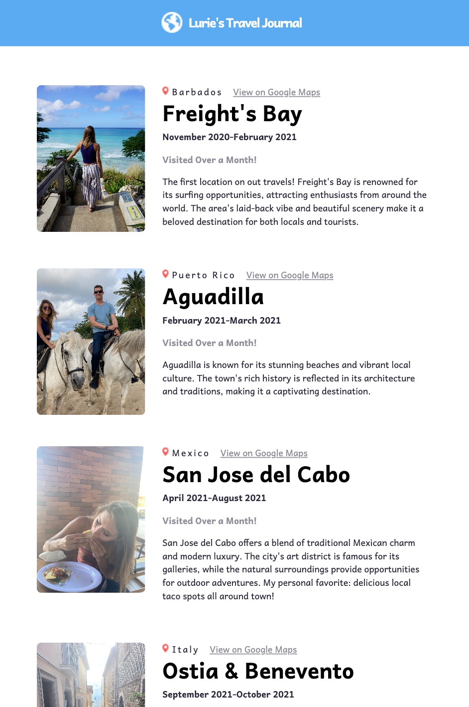

# Lurie's Travel Journal

Lurie's Travel Journal is a React project that showcases various travel locations. It's built using modern React features and provides an interactive way to view different travel destinations.




## Technology Used

- **React**: The project is built using React 18.2.0, utilizing functional components and JSX.
- **React-DOM**: Used for rendering the components into the DOM.
- **CSS**: Styling is applied using a separate CSS file to ensure a clean and attractive design.

## Project Structure

### `App.js`

The main component of the application that imports the `Card` and `Header` components. It maps through the data and renders each travel location using the `Card` component.

### `Card.js`

This component represents an individual travel location. It receives the location data as props and renders the details, including the country, location name, dates, and a brief description. It also provides a link to view the location on Google Maps. Additionally, the `Card.js` component uses conditional rendering to display whether the stay at the location was a long visit (over a month) or a short visit. This information is dynamically rendered based on the `longStay` property in the data.

### `Header.js`

A simple header component that displays the title of the application along with a globe icon.

### `index.js`

The entry point of the application, where the `App` component is rendered into the root element.

### `styles.css`

Contains all the styling rules for the application, ensuring a consistent and appealing visual design.

## Installation and Running

To install the dependencies, run:

```bash
npm install
```

To start the development server, run:

```bash
npm start
```

## License

This project is open-source and available under the MIT License.

